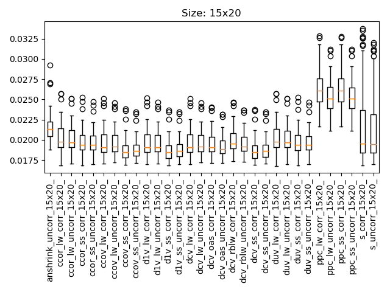
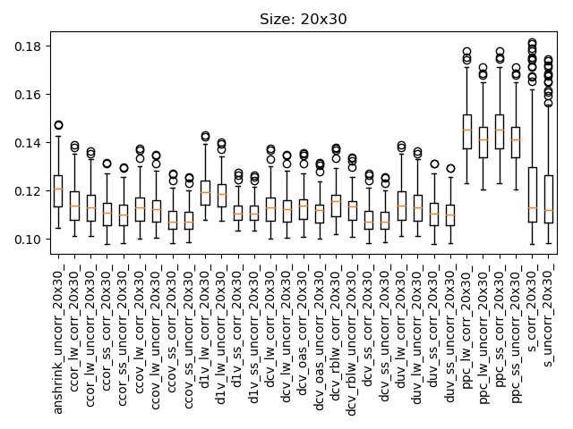
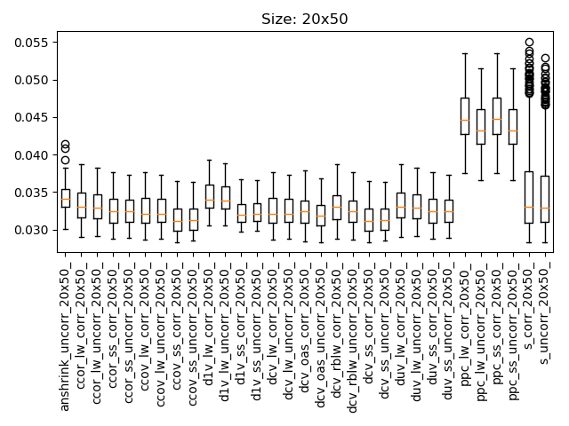
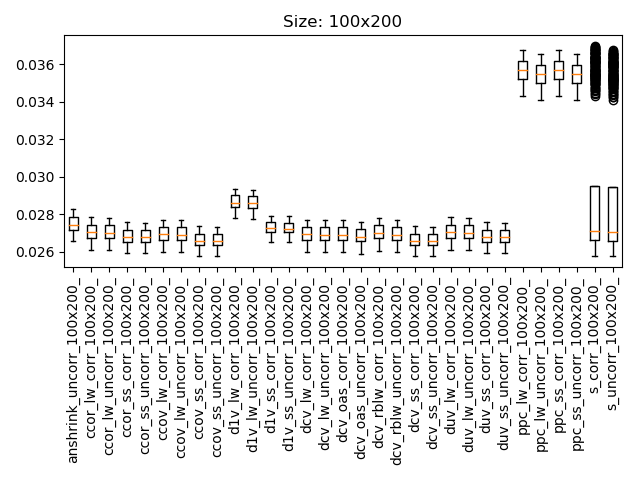

# [MSE Comparison](@id msecomp)

Below are results obtained with a variety of data matrices of dimensions $n\times p$.
For each pair of dimension, 50 covariance matrices are generated with associated sample data matrices.
The covariance obtained with the different estimators are then compared to the ground-truth and the MSE is reported.

| Abbreviation | Method |
| ---- | ---- |
| `anshrink` | analytical nonlinear shrinkage |
| `ccor` | LSE with constant correlation target |
| `ccov` | LSE with constant covariance target |
| `d1v`  | LSE with identity target |
| `dcv`  | LSE with diagonal common variance target |
| `duv`  | LSE with diagonal unequal variance target |
| `ppc`  | LSE with perfect positive correlation target |
| `s`  | Simple estimator (baseline) |
| `_lw`  | uses ledoit-wolf shrinkage |
| `_ss`  | uses schaffer-strimmer shrinkage |
| `_oas`  | uses oracle approximating shrinkage |
| `_rblw`  | uses rao-blackwellised ledoit-wolf shrinkage |

## Fat matrices

## Tall matrices

