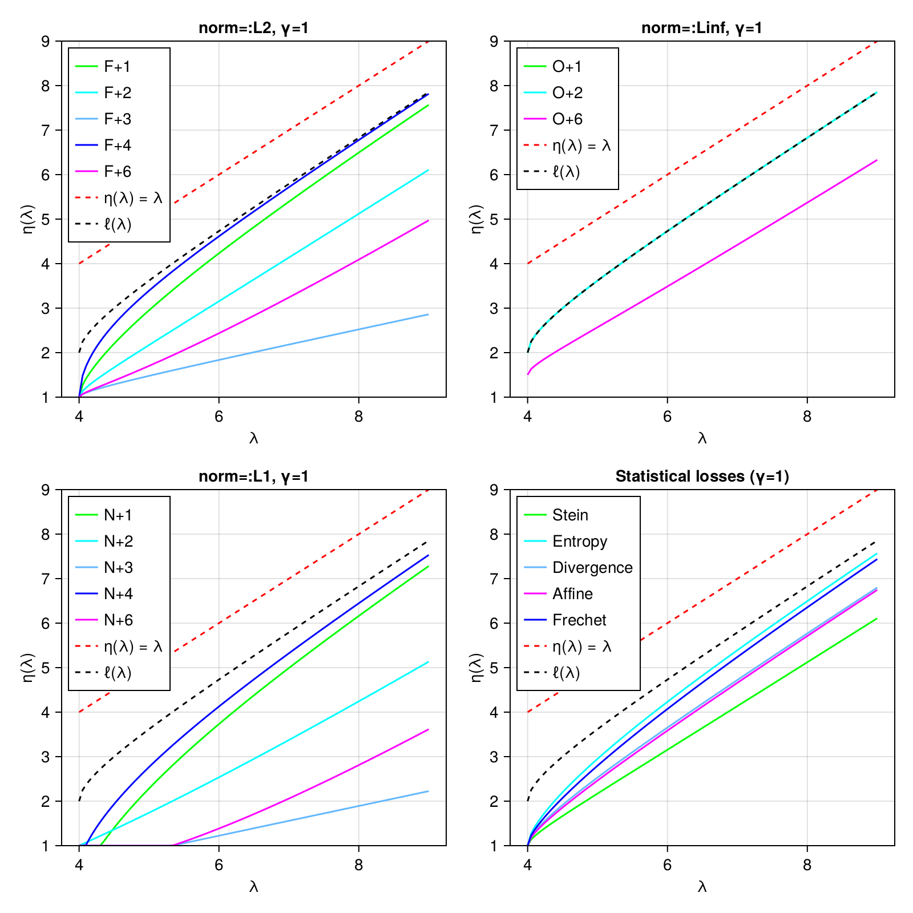

# [Nonlinear shrinkage estimators](@id nlshrink)

Nonlinear shrinkage estimators correspond to covariance estimators based on the eigendecomposition of the sample matrix:

```
F = eigen(X)
# ... (transformation of eigenvalues)
F.U*(d̃ .* F.U') # d̃ is a vector of transformed eigenvalues
```

Currently, there are two flavors of analytical nonlinear shrinkage:
- [`AnalyticalNonlinearShrinkage`](@ref) is recommended in cases where the covariance matrix can be stored as a dense matrix
- for cases where the covariance matrix is too large to handle in dense form, [`WoodburyEstimator`](@ref) models the covariance matrix as

    Σ = σ²I + U * Λ * U'

where `σ` is a scalar, `I` is the identity matrix, `U` is a low-rank semi-orthogonal matrix, and `Λ` is diagonal.
One can readily compute with this representation via the [Woodbury matrix identity](https://en.wikipedia.org/wiki/Woodbury_matrix_identity) and the [WoodburyMatrices package](https://github.com/JuliaLinearAlgebra/WoodburyMatrices.jl).
This formulation approximates the covariance matrix as if all but a few (largest) eigenvalues are equal to `σ²`.
A [truncated singular value decomposition](https://github.com/JuliaLinearAlgebra/TSVD.jl) of the data matrix is
performed and the corresponding eigenvalues are shrunk by optimal methods for a wide variety of loss functions:

- [`NormLossCov`](@ref) allows you to specify that you want to minimize some notion of loss against the "true" covariance matrix
- [`StatLossCov`](@ref) allows you to optimize for certain specific statistical outcomes, e.g., optimizing the accuracy of Mahalanobis distances.

The eigenvalue shrinkage function is plotted for all choices below (`γ = p/n`, the ratio of the dimensionality to the number of observations):



For complete details, see:

Donoho, D.L., Gavish, M. and Johnstone, I.M., 2018.
Optimal shrinkage of eigenvalues in the spiked covariance model. Annals of statistics, 46(4), p.1742.
